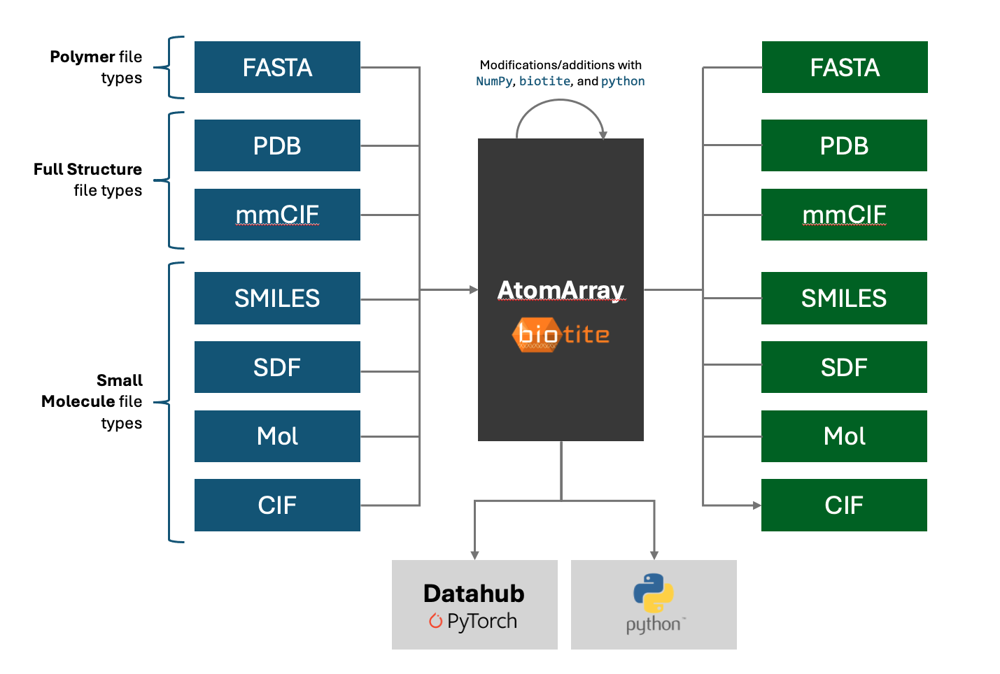

[](https://github.com/astral-sh/ruff)
[](https://github.com/baker-laboratory/cifutils/actions/workflows/lint_and_test.yaml)

# ! CIFUTILS IS FROZEN AS WE BEGIN THE MOVE TO ATOMWORKS !


# Table of Contents
- [Table of Contents](#table-of-contents)
- [CIFUtils](#cifutils)
  - [CIFUtils vs. Datahub](#cifutils-vs-datahub)
    - [CIFUtils](#cifutils-1)
    - [Datahub](#datahub)
- [Install instructions](#install-instructions)
  - [1. (⭐️ Recommended) Using `cifutils` via the standalone cifutils apptainer](#1-️-recommended-using-cifutils-via-the-standalone-cifutils-apptainer)
  - [2. Using `cifutils` with a local conda version](#2-using-cifutils-with-a-local-conda-version)
  - [3. Using `cifutils` in your apptainer environment](#3-using-cifutils-in-your-apptainer-environment)
- [Apptainer build instructions](#apptainer-build-instructions)
- [Basic Usage](#basic-usage)
    - [Example Flow](#example-flow)
    - [Returned Dictionary](#returned-dictionary)
    - [Parsing Arguments](#parsing-arguments)
      - [Caching Arguments](#caching-arguments)
- [Glossary](#glossary)
    - [Entities vs. Instances](#entities-vs-instances)
    - [Suffixes](#suffixes)
    - [Chains, PN\_Units, and Molecules](#chains-pn_units-and-molecules)
    - [Combinatorial Nomenclature - Worked Example](#combinatorial-nomenclature---worked-example)
      - [Chains](#chains)
      - [PN\_Unit](#pn_unit)
      - [Molecules](#molecules)
- [Contributing guidelines](#contributing-guidelines)

# CIFUtils
We introduce `CIFUtils` — a full-featured toolkit for converting arbitrary biological inputs (e.g., `mmCIF`, `pdb`, `SMILES`, `MOL`, `FASTA`, etc.) into Biotite's general `AtomArray` API, performing structural and chemical operations, and ultimately passing over the `AtomArray` to a deep-learning model (see: [`datahub`](https://github.com/baker-laboratory/datahub) or saving back out to arbitrary formats.

We leverage the open-source [`biotite` library](https://www.biotite-python.org/) for our core parsing operations due to the library's speed and flexibility. 

## CIFUtils vs. Datahub
The two Baker Lab data loading and featurization codebases — `cifutils` and `datahub` — are symbiotic, with catering to distinct use cases and user bases. The separation of concerns between the two repositories is as follows:

### CIFUtils
Roughly speaking, we define `cifutils` as "get any arbitrary inputs into an `AtomArray`, perform custom operations, and convert the modified `AtomArray` back to arbitraty inputs." Since the `AtomArray` is our common structural API, once we load inputs into that format, we can process with relevant tools (e.g., `RDKit`, `OpenBabel`) and ultimately export as any other supported format (e.g., `PDB`, `CIF`, `FASTA`, `SMILES`, etc. etc.). User Base: Protein designers, model developers, and other computational users who want to load, modify, and save structural representations of proteins or small molecules.

Common use cases include:
* **Structural data format to sequence data format:** Load a structural file (e.g., PDB, CIF, etc.) and convert to sequence files (e.g., FASTA, SMILES). Essentially, "hides" all structural information, while preserving all sequence information.
* **Sequence data format to structural data format:** Load a series of sequence files (e.g., FASTA, SMILES) into an `AtomArray`, populated with empty coordinates for all atoms. This `AtomArray` can then be the starting point for structure prediction model inference (e.g., through `datahub`)
* **Structural data format to structural data format:** Load structural data (e.g., CIF) into an `AtomArray`, perform operations (e.g., with `RDKit`, `OpenBabel`, or directly `python` and `biotite`), then save back to a structural data format (or pass the `AtomArray` to `datahub` directly for model training)

<br/>



### Datahub
Take an `AtomArray` (and possibly some metadata) and featurize for model training pipelines, including full datasets, sampling, etc. User Base: Model developers preparing data pipelines for deep-learning tasks.
# Install instructions
All the basic operations (building apptainers, instaling, formatting, testing) are handled by the [Makefile](./Makefile). For example, to install `cifutils` in a fresh conda environment, you can run `make env`. If you want to see all available make recipes, just run `make` or `make help` (they are equivalent).

Below is a bit more in-depth information on the different ways to use `cifutils`. We recommend approach #1 for most users.

## 1. (⭐️ Recommended) Using `cifutils` via the standalone cifutils apptainer
This option is recommended for dataset parsing and generation if you save a static
version of your dataset that you then use with your own project's apptainer and do not 
require `cifutils` in your project's environment. It will only work if you are at the IPD.

We built a standalone apptainer for `cifutils` that includes all the dependencies needed to 
run or develop with `cifutils`. The apptainer is based on the [apptainer.spec](./apptainer.spec) file
and can be found at:

```bash
# set up the IPD-specific environment variables
source ./.ipd/setup.sh

# Path to latest development & production apptainer for cifutils on `digs`
# ... you can use this one to execute any files
./.ipd/cifutils.sif
```

## 2. Using `cifutils` with a local conda version
This option is recommended for development and testing of the `cifutils` package.

**Option 1: Install into existing environment**:

```bash
# If you just want to use the project
git clone git@git.ipd.uw.edu:ai/cifutils.git
cd cifutils
make install  # (or alternatively `pip install -e "."` if you don't need to also update the dependencies)

# NOTE: It is important that you `pip install` the package, since we use a src-layout. If for some reason you
#  do not want to pip install into your conda environment, you will need to add the src folder to your python
#  path: 
#  export PYTHONPATH=$PWD/src:$PYTHONPATH
```

You will then need to create a `.env` file (see: `.env.sample`) with a path to the CCD that you wish to use and, optionally, the PDB path (required for tests).

**Option 2: Install into a fresh environment**
You can use this simplified workflow below to install `cifutils` into a fresh conda environment that will be called `cifutils-dev`. Alternatively, you can manually install from the [environment.yaml](./environment.yaml) file.
```bash
## Step 1. Clone git repo
git clone git@git.ipd.uw.edu:ai/cifutils.git
cd cifutils

## Step 2. Set up Gitlab username and token in a .bashrc file
## Fill in with your own Gitlab username and Gitlab token
## Also explicitly set the tmp directory for installation 
## (you will need to create a token first: https://git.ipd.uw.edu/-/user_settings/personal_access_tokens)
## (your token will need the `read_repository` scope)
echo 'export GITLAB_USER=<Gitlab_Username>' >> .bashrc
echo 'export GITLAB_TOKEN=<Gitlab_PAT_Token>' >> .bashrc
source .bashrc

## Step 3. Install
make env

## Step 4. Test Installation
pytest tests
```

Like in (1), you will then need to create a `.env` file (see: `.env.sample`) with a path to the CCD that you wish to use.

## 3. Using `cifutils` in your apptainer environment
This is recommended if you are developing a project that will use `cifutils` as a dependency 
and you want to use tools from `cifutils` within your project's code. This option will
be the preferred option for code developers.

**For existing apptainers**:
You need to add `cifutils/src` to your apptainer environment's PYTHONPATH. You can do this by
running the following command in your apptainer environment:
```bash
export PYTHONPATH=$PWD/src:$PYTHONPATH
```

Or if you are at the IPD, you can use the following command:
```bash
source ./.ipd/setup.sh
```
which automatically also sets up the correct CCD & PDB mirror paths on digs.

**For new apptainers**:
For more information, see the `apptainer.spec` file in the root of the repo, which builds the
standalone `cifutils` apptainer. You can copy the sections from there to your project's apptainer
spec file, add your project dependencies and then build your project's apptainer.

# Apptainer build instructions
To rebuild the standalone `cifutils` apptainer, simply run `make apptainer` in the root of the repo.

If that should not work for some reason, you can also manually build the apptainer image
```bash
# Replace the below with your Gitlab username and personal access token 
# (you will need to create a token first: https://git.ipd.uw.edu/-/user_settings/personal_access_tokens)
# (your token will need the `read_repository` scope)
export GITLAB_USER=<Gitlab_Username>
export GITLAB_TOKEN=<Gitlab_PAT_Token>
# If you want to permanently add these tokens to your environment variables, you
# can append the export statements to your .bashrc or .zshrc file.
apptainer build --bind $PWD:/cifutils_host cifutils.sif apptainer.spec
```
# Basic Usage

### Example Flow
Import the `parse` method from the `cifutils` module:
```python
from cifutils.parser import parse
```
Create a path to the CIF file of interest:
```python
path = "/databases/rcsb/cif/ne/3nez.cif.gz"
```
Parse away!
```python
result = parse(
    filename=path,
)
```

### Returned Dictionary
The `parse` function returns a dictionary with keys:

-  **`chain_info`**: A dictionary mapping each chain ID to its *sequence*, *chain type* (as an `IntEnum`), *RCSB entity*, *EC number*, and other relevant information. 
-  **`ligand_info`**: A dictionary containing information about ligands of interest within the example; e.g., fit-to-density metrics.
-  **`asym_unit`**: An `AtomArrayStack` instance representing the asymmetric unit of the structure. 
-  **`assemblies`**: A dictionary mapping assembly IDs to `AtomArrayStack` instances. All assemblies are loaded, both computationally- and author-generated.
-  **`metadata`**: A dictionary containing metadata about the structure, such as resolution, deposition date, release date, and other crystallographic or experimental details
-  **`extra_info`**: A dictionary containing additional information used for cross-compatibility and caching. This key is primarily for internal use and should not be accessed directly in typical use cases.

For more detail, see the documentation within the code.

### Parsing Arguments

These arguments modify how the CIF or PDB file is parsed and processed:

| Name                                 | Type                               | Default                | Description                                                                                                                                                      |
|--------------------------------------|------------------------------------|------------------------|------------------------------------------------------------------------------------------------------------------------------------------------------------------|
| `filename`                           | `PathLike \| io.StringIO \| io.BytesIO` | —                      | The path to the structural file. Supports various file formats, including `.cif`, `.cif.gz`, and `.pdb`. `.cif` files are strongly recommended for reliability. |
| `add_missing_atoms`                  | `bool`                             | `True`                 | Determines whether missing atoms should be added to the structure. Useful for structures with unresolved residues (e.g., those coming from the PDB). Not that when adding missing atoms, we also add intra- and inter-residue bonds (required to remove leaving groups).|
| `add_id_and_entity_annotations`      | `bool`                             | `True`                 | Whether to add `id` and `entity` annotations at the `chain`, `pn-unit`, and `molecule`-level to the `AtomArray`.                                                                 |
| `add_bond_types_from_struct_conn`    | `list[str]`                        | `["covale"]`           | A list of bond types to add to the structure from the `struct_conn` category. For example, "covale" means that only covalent bonds will be added, no disulfide bonds, metal coordination bonds, etc..     |
| `remove_ccds`                        | `list[str]`                        | `CRYSTALLIZATION_AIDS` | A list of CCD codes (e.g., `DMO`, ...) to remove from the structure. Exclusion of polymer residues and common multi-chain ligands must be done with care to avoid sequence gaps. |
| `remove_waters`                      | `bool`                             | `True`                 | Option to remove water molecules from the structure.                                                                                                             |
| `fix_ligands_at_symmetry_centers`    | `bool`                             | `True`                 | Whether to patch non-polymer residues at symmetry centers that clash with themselves when transformed; important when building biological assemblies.           |
| `fix_arginines`                      | `bool`                             | `True`                 | Resolves arginine naming ambiguities, as detailed in the AF-3 supplement.                                                                                        |
| `fix_formal_charges`                      | `bool`                             | `True`                 | Corrects formal charges after forming inter-residue bonds (`add_missing_atoms` must be `True`, or has no effect)|
| `convert_mse_to_met`                 | `bool`                             | `False`                | Converts selenomethionine (MSE) residues to methionine (MET) residues.                                                                                           |
| `remove_hydrogens`                     | `bool`                             | `False`                 | Determines whether hydrogens should be removed from structure.                                                                                                     |
| `model`                              | `int \| None`                      | `None`                 | The model number to parse for NMR entries. Defaults to parsing all models.                                                                                       |
| `build_assembly`                     | `Literal["first", "all"] \| list[str] \| tuple[str, ...] \| None` | `"all"` | Specifies which assembly to build: `None` for the asymmetric unit, `"first"` for the first assembly, `"all"`, or a list or tuple of specific assembly IDs.      |

#### Caching Arguments

These arguments control the caching behavior of the parsing process:

| Name              | Type                | Default | Description                                                                                                                   |
|-------------------|---------------------|---------|-------------------------------------------------------------------------------------------------------------------------------|
| `load_from_cache` | `bool`              | `False` | Specifies whether to load pre-compiled results from cache. Speeds up repeated parsing operations when the structure is unchanged. |
| `save_to_cache`   | `bool`              | `False` | Indicates whether to save the parsed results to cache, allowing for faster future retrievals of the same structure.             |
| `cache_dir`       | `PathLike \| None`  | `None`  | The directory path where cached results are stored. Must be provided if either `load_from_cache` or `save_to_cache` is `True`. |


# Glossary
> "The PDB is a scary place, don't go there." - Rohith Krishna, c. 2022

We adopt a consistent, composable naming convention for different 'bits' of a `mmCIF` file throughout data parsing, preprocessing, loading, and featurization such that our code remains unambiguous. Familiarity with our conventions is required for deciphering, and contributing to, our shared codebase. We outline these conventions below:

### Entities vs. Instances
Within our nomenclature, `entities` are chemical compounds where we distinguish the *(covalent) connectivity and components*, but not the coordinates. `instances`, meanwhile, are unique copies of an `entity` in 3D. If you think of it in terms of python: `entity ~ class` and `instance ~ instance` of that class.

For example, within a `mmCIF` file, there may be multiple copies of the same chain (sometimes referred to as `asym_id` in PDB files), each with a unique set of coordinates, but identical sequences and connectivities. These compounds are distinct `instances`, but the same underlying `entity` (i.e., same UNIREF identifier). 

### Suffixes
- `_entity`: A unique numeric `id` for each `entity`.
- `_id`: A group `id`, that may or may not be more than one instance, subdivided for example through symmetries during assembly building. For exampe, we would consider the PDB's `asym_id` to be an `_id`, as it uniquely specifies the entity, but not the instance (due to transformations). If unfamiliar with transformations and biological assemblies in the PDB, read [this helpful article from RCSB](https://pdb101.rcsb.org/learn/guide-to-understanding-pdb-data/biological-assemblies) before continuing.
- `_iid`: The "instance ID", which uniquely specifies a group of atoms in three-dimensional space. 

### Chains, PN_Units, and Molecules

1. **Chains**. The smallest covalently bound unit within the PDB is the "chain," with each chain represented in a `mmCIF` file by a unique combination of an `asym_id` and a `transformation_id`. 
2. **PN_Unit**: Short for "polymer or non-polymer unit". We define a `pn_unit` as covalently linked chains of the same type. For example, an oligosaccharide may be represented as multiple non-polymer chains covalently bound together, which we should treat as one `pn_unit`. However, an oligosaccharide bound to a protein would be two separate `pn_units` (one for the oligosaccharide, one for the protein), as they differ in chain type.
3. **Molecule**: This is aligned with the definition of a molecule in chemistry (created by traversal of the bond graph). It refers to a single connected component of a covalent bond graph. May contain multiple `pn_units` (e.g. a covalent modification of a protein with a glycan would be 2 `pn_units` but 1 `molecule`).

### Combinatorial Nomenclature - Worked Example

Imagine we have three chains in the `mmCIF` file asymmetric unit, `A`, `B`, and `C`. We also, through symmetry, build the biological unit through a reflection of the asymmetric unit. Assume that `A` is a polymer, `B` and `C` are two covalently bound sugars, each with the same chemical formula and bond connectiviy, and `B` is covalently bound to a residue in `A` (glycosylation).

Putting it all together, we arrive at the following combinatorial nomenclature to describe the different components in our fictional entry:
#### Chains
- `chain_id`: "A", "B", "C"
- `chain_iid`: "A_1", "B_1", "C_1" (first transform, identity) and "A_2", "B_2", and "C_2" (second transform, reflection)
- `chain_entity`: 1, 2, 2 correspondong to `chain_ids` "A", "B", and "C", respectively

#### PN_Unit
- `pn_unit_id`: "A", "B,C"
- `pn_unit_iid`: "A_1", "B_1,C_1", "A_2", "B_2,C_2"
- `pn_unit_entity`: 1, 2, corresponding to `pn_unit_ids` "A" and "B,C", respectively

#### Molecules
- `molecule_id`: 1 (numeric for memory concerns, but can be conceptualized as "A,B,C")
- `molecule_iid`: 1 (numeric for memory concerns, but can be conceptualized as "A_1,B_1,C_1"), 2 (e.g., "A_2,B_2,C_2")
- `molecule_entity`: 1

# Contributing guidelines
When contributing to this repository, please follow these steps:

1. Clone the repository
2. Create the development environment (see [option 2](#2-using-cifutils-with-a-local-conda-version) above)
3. Create a new branch for your changes. 
- Use the following convention to name your branch: `<category>/<description>`. We use the following categories:
    - `feat` for adding or removing a feature
    - `fix` for bug fixes
    - `hotfix` for changing code with a temporary solution or without following the usual process (in case of emergency)
    - `refactor` for code refactoring
    - `docs` for documentation changes
    - `perf` for performance improvements
- The `<description>` should be a short summary of the changes you are making. 
- *Example*:  For example if you are adding new functionality to deal with small molecules using RDKit you may use `git checkout -b feat/support-rdkit-small-molecule`.
4. Make and commit your changes on your new branch. 
- When making a commit, try to limit your commits to a single logical change or feature and commit more often, rather than committing everything at once.
- When committing, make sure you run autoformatting tools (`make format`) first. This will ensure that your code is formatted according to the project's unified style and will prevent unnecessary merge conflicts.
- For naming commits, use the following convention: `<type>: <description>`. We use the following types (inspired by [conventional commits](https://www.conventionalcommits.org/en/v1.0.0/)):
    - `feat` for adding or removing a feature
    - `fix` for bug fixes
    - `refactor` for code refactoring
    - `docs` for documentation changes
    - `chore` for everything else
    - `wip` for work in progress (avoid using this if possible, mostly for checkpointing temporary changes that still require work to completion)
- *Example*: For example, adding these contributing guidelines might be commited as: 
    ```bash
    make format  # autoformat, lint and clean the code
    git commit -m "docs: add contributing guidelines"  # commit the changes
    ```
5. When you are done with your changes, open a pull request to `main` and briefly describe what you have changed, why and how a reviewer can best review and test it.
6. Wait for your review and merge your changes.
