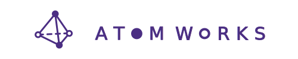

[](https://github.com/astral-sh/ruff)
[](https://pypi.org/project/atomworks/)
[](https://pypi.org/project/atomworks/)
[](https://baker-laboratory.github.io/atomworks-dev/latest)
[](https://opensource.org/licenses/BSD-3-Clause)



**atomworks** is an open-source platform that maximizes research velocity for biomolecular modeling tasks. Much like how [Torchdata](https://docs.pytorch.org/data/beta/index.html) enables rapid prototyping within the vision and language domains, AtomWorks aims to accelerate development and experimentation within biomolecular modeling.

If you're looking for the models themselves (e.g., RF3, MPNN) that integrate with AtomWorks rather than the underlying framework, check out [ModelForge](https://github.com/RosettaCommons/modelforge)

AtomWorks is composed of two symbiotic libraries:

- **atomworks.io:** A universal Python toolkit for parsing, cleaning, manipulating, and converting biological data (structures, sequences, small molecules). Built on the [biotite](https://www.biotite-python.org/) API, it seamlessly loads and exports between standard formats like mmCIF, PDB, FASTA, SMILES, MOL, and more.
- **atomworks.ml:** Advanced dataset featurization and sampling for deep learning workflows that uses `atomworks.io` as its structural backbone. We provide a comprehensive, pre-built and well-tested set of `Transforms` for common tasks that can be easily composed into full deep-learning pipelines; users may also create their own `Transforms` for custom operations.

For more detail on the motivation for and applications of AtomWorks, please see the [preprint](https://doi.org/10.1101/2025.08.14.670328). 

AtomWorks is built atop [biotite](https://www.biotite-python.org/): We are grateful to the Biotite developers for maintaining such a high-quality and flexible toolkit, and hope that our package will prove a helpful addition to the broader `biotite` community.

---

## atomworks.io

*A general-purpose Python toolkit for working with biomolecular files*

**atomworks.io** lets you:
- Parse, convert, and clean any common biological file (structure or sequence). For example, identifying and removing leaving groups, correcting bond order after nucleophilic addition, fixing charges, parsing covalent geometries, and appropriate treatment of structures with multiple occupancies and ligands at symmetry centers
- Transform all data to a consistent `AtomArray` representation for further analysis or machine learning applications, regardless of initial source
- Model missing atoms (those implied by the sequence but not represented in the coordinates) and initialize entity- and instance-level annotations (see the [glossary]() for more detail on our composable naming conventions)

We have found `atomworks.io` to be useful to a general bioinformatics and protein design audience; in many cases, `atomworks.io` can replace bespoke scripts and manual curation, enabling researchers to spend more time testing hypothesis and less time juggling dozens of tools and dependencies.

---

## atomworks.ml

*Modular, component-based library for dataset featurization within biomolecular deep learning workflows*

**atomworks.ml** provides:
- A library of pre-built, well-tested `Transforms` that can be slotted into novel pipelines
- An extensible framework, integrated with `atomworks.io`, to write `Transforms` for arbitrary use cases
- Scripts to pre-process the PDB or other databases into dataframes appropriate for network training
- Efficient sampling and batching utilities for training machine learning models

Within the AtomWorks paradigm, the output of each `Transform` is not an opaque dictionary with model-specific tensors but instead an updated version of our atom-level structural representation (Biotite's `AtomArray`). Operations within – and between – pipelines thus maintain a common vocabulary of inputs and outputs.

---

## Installation

```shell
pip install atomworks # base installation version without torch (for only atomworks.io)
pip install "atomworks[ml]" # with torch and ML dependencies (for atomworks.io plus atomworks.ml)
pip install "atomworks[dev]" # with development dependencies
pip install "atomworks[ml,dev]" # with all dependencies
```

If you are using [uv](https://docs.astral.sh/uv/reference/policies/versioning/) for package management, you can install atomworks with:

```shell
uv pip install "atomworks[ml,openbabel,dev]"
```

For more advanced setup options (including how to run workflows via apptainers) see the [full documentation](https://baker-laboratory.github.io/atomworks-dev/latest).

---

## Quick Start

```python

from atomworks.io.parser import parse

result = parse(filename="3nez.cif.gz")

for chain_id, info in result["chain_info"].items():
print(chain_id, info["sequence"])

```

Output includes:
- **chain_info** — Sequences/metadata for each chain
- **ligand_info** — Ligand annotation & metrics
- **asym_unit** — Structure (`AtomArrayStack`)
- **assemblies** — Built biological assemblies (each are their own `AtomArrayStack`)
- **metadata** — Experimental and source information

See [usage examples](https://baker-laboratory.github.io/atomworks-dev/latest/auto_examples/).

---

## When to use atomworks.io vs atomworks.ml?

- Use **atomworks.io** when you:
    - Need to parse/clean/convert between biological file formats (mmCIF, PDB, FASTA, etc.)
    - Want a unified structural representation to plug into any downstream analysis or modeling
    - Need structural operations like adding missing atoms, filtering ligands/solvents, or assembly generation

- Use **atomworks.ml** when you:
    - Need to featurize entire datasets for deep learning
    - Want ready-made sampling and batching utilities for training pipelines
    - Already use atomworks.io and want a seamless bridge to ML-ready feature engineering

---

## Contribution

We welcome improvements!  
Please see the [full documentation](https://baker-laboratory.github.io/atomworks-dev/latest) for contribution guidelines.

## Citation

If you make use of AtomWorks in your research, please cite:

* N. Corley, S. Mathis, R. Krishna, M. S. Bauer, T. R. Thompson, W. Ahern, M. W. Kazman, R. I. Brent, K. Didi, A. Kubaney, L. McHugh, A. Nagle, A. Favor, M. Kshirsagar, P. Sturmfels, Y. Li, J. Butcher, B. Qiang, L. L. Schaaf, R. Mitra, K. Campbell, O. Zhang, R. Weissman, I. R. Humphreys, Q. Cong, J. Funk, S. Sonthalia, P. Lio, D. Baker, F. DiMaio,
"Accelerating Biomolecular Modeling with AtomWorks and RF3," bioRxiv, August 2025. doi: [10.1101/2025.08.14.670328](https://doi.org/10.1101/2025.08.14.670328)
