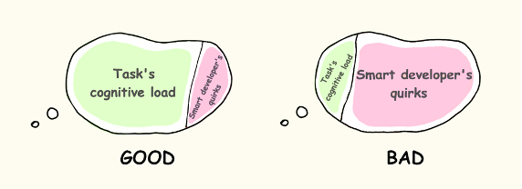
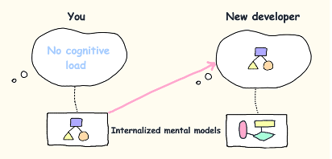

.. _contributor-best-practices:

===============================
Contributing
===============================

.. note::
   This is a non-exhaustive list of best practices for contributing code, based on industry standards and our team's experience.

As you code
-------------

1. **Reduce cognitive overhead:**
   a. Pick meaningful, descriptive variable names.
   b. Write docstrings (leverage AI!) and comments.
   c. Follow the `Python Zen <https://peps.python.org/pep-0020/>`_ – explicit is better than implicit, etc.
2. **Write tests.**

As you commit
---------------

1. Keep commits as "one logical unit". (Easy to do in VSCode)
2. Adhere to `semantic commit conventions <https://www.conventionalcommits.org/en/v1.0.0/>`_.
3. Format & lint your code (``make format``).
4. Submit a draft PR so people know you are working on this & can provide advice/feedback early on.

As you finalize a PR
---------------------

1. Keep overall PR under <400 LOC (Rule of thumb: 500 LOC takes about 1h to review).
2. Read and fill out the PR checklist.

As you review
---------------

1. Foster a positive review culture – we want to learn from each other. Be critical but kind.
2. Practice light-weight code reviews. Submit something small to atomworks.io/atomworks.ml that fixes a bug / improves documentation / adds a tiny feature to practice this within the next 24h. (Can be less than 30min)
3. Keep review time <1h and <500 LOC for focus.

Visual Aids
-----------

More detail
-----------

- `Best Practices for Code Review | SmartBear <https://smartbear.com/learn/code-review/best-practices-for-peer-code-review/>`_

.. raw:: html

   

PR Hygiene
=================

When contributing to this repository, please follow these steps:

1. Clone the repository
2. Create the development environment (see Installation section)
3. Create a new branch for your changes. 
   - Use the following convention to name your branch: `<category>/<description>`. Categories: `feat`, `fix`, `hotfix`, `refactor`, `docs`, `perf`.
   - Example: `feat/support-rdkit-small-molecule`
4. Make and commit your changes on your new branch. 
   - Run autoformatting tools (`make format`) before committing.
   - Use commit messages like `<type>: <description>`. Types: `feat`, `fix`, `refactor`, `docs`, `chore`, `wip`.
   - Example: `git commit -m "docs: add contributing guidelines"`
5. Open a pull request to `main` and describe your changes.
6. Wait for review and merge your changes.

For more details, see the README or contact the maintainers. 