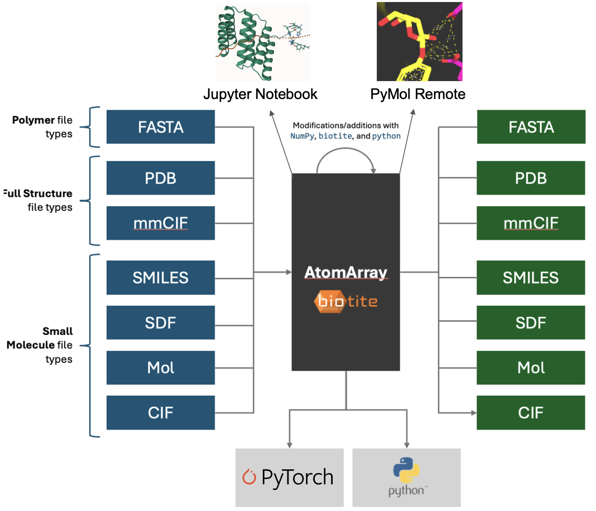

Tutorial
========

Getting Started
---------------

**atomworks** is a Python toolkit for parsing, manipulating and featurizing biological structure and sequence data. It provides a unified interface for working with mmCIF, PDB, FASTA, SMILES, and more, enabling seamless conversion and preparation for downstream analysis or machine learning. Built on top of Biotite, it offers robust parsing, annotation, and transformation utilities for protein, nucleic acid, and small molecule data.

Quick Install:

.. code-block:: bash

   pip install atomworks  # or see Installation section for more options

.. toctree::
   :maxdepth: 2
   :caption: Main Concepts

   parser
   tools
   transforms
   utils 